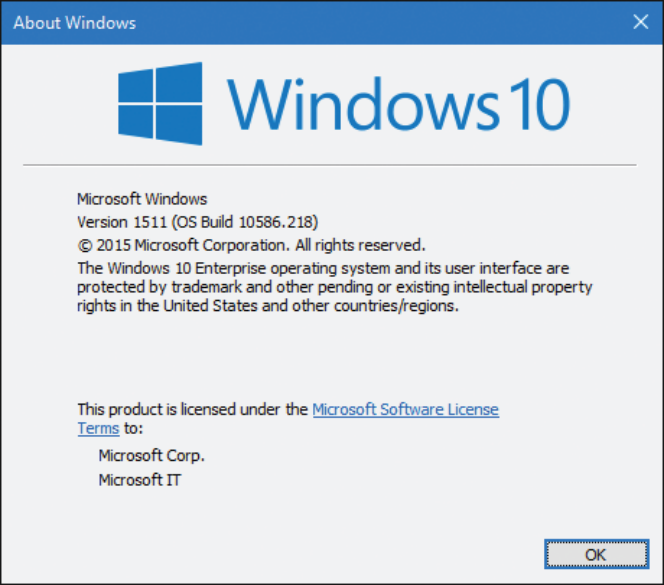

# Concepts and tools

In this chapter, we’ll introduce the key Microsoft Windows operating system (OS) concepts and terms we’ll be using throughout this book, such as the Windows API, processes, threads, virtual memory, kernel mode and user mode, objects, handles, security, and the registry. We’ll also introduce the tools that you can use to explore Windows internals, such as the kernel debugger, the Performance Monitor, and key tools from Windows Sysinternals (*http://www.microsoft.com/technet/sysinternals*). In addition, we’ll explain how you can use the Windows Driver Kit (WDK) and the Windows Software Development Kit (SDK) as resources for finding further information on Windows internals.

Be sure that you understand everything in this chapter; the remainder of the book is written assuming that you do.

## Windows operating system versions

This book covers the most recent version of the Microsoft Windows client and server operating systems: Windows 10 (32-bit on x86 and ARM, and 64-bit version on x64) and Windows Server 2012 R2 (which exists as 64-bit version only). Unless specifically stated, the text applies to all versions. As background information, Table 1-1 lists the Windows product names, their internal version number, and their release date.

TABLE 1-1 Windows operating system releases

| Product Name           | Internal Version Number | Release Date   |
|------------------------|-------------------------|----------------|
| Windows NT 3.1         | 3.1                     | July 1993      |
| Windows NT 3.5         | 3.5                     | September 1994 |
| Windows NT 3.51        | 3.51                    | May 1995       |
| Windows NT 4.0         | 4.0                     | July 1996      |
| Windows 2000           | 5.0                     | December 1999  |
| Windows XP             | 5.1                     | August 2001    |
| Windows Server 2003    | 5.2                     | March 2003     |
| Windows Server 2003 R2 | 5.2                     | December 2005  |
| Windows Vista          | 6.0                     | January 2007   |
| Windows Server 2008    | 6.0 (Service Pack 1)    | March 2008     |
| Windows 7              | 6.1                     | October 2009   |
| Windows Server 2008 R2 | 6.1                     | October 2009   |
| Windows 8              | 6.2                     | October 2012   |
| Windows Server 2012    | 6.2                     | October 2012   |
| Windows 8.1            | 6.3                     | October 2013   |
| Windows Server 2012 R2 | 6.3                     | October 2013   |
| Windows 10             | 10.0 (build 10240)      | July 2015      |
| Windows 10 version 1511 | 10.0 (build 10586)     | November 2015  |
| Windows 10 version 1607 (Anniversary Update) | 10.0 (build 14393)     | July 2016      |
| Windows Server 2016     | 10.0 (build 14393)     | October 2016   |

This book covers the most recent version of the Microsoft Windows client and server operating systems: Windows 10 (32-bit on x86 and ARM, and 64-bit version on x64) and Windows Server 2012 R2 (which exists as 64-bit version only). Unless specifically stated, the text applies to all versions. As background information, Table 1-1 lists the Windows product names, their internal version number, and their release date.

**Note** Starting with Windows 8, the GetVersionEx Windows API function returns the OS version number as 6.2 (Windows 8) by default, regardless of the actual OS. (The function is also declared as deprecated.) This is done to minimize compatibility issues but also as an indicator that checking for the OS version is not the best approach in most cases. This is because some components can be installed out of band, without coinciding with an official Windows release. Still, if you need the actual OS version, you can obtain it indirectly by using the VerifyVersionInfo function or the newer version helper APIs, such as IsWindows8OrGreater, IsWindows8Point1OrGreater, IsWindows10OrGreater, IsWindowsServer, and similar. Also, OS compatibility can be indicated in the executable’s manifest, which changes the results of this function. (See Chapter 8, “System mechanisms,” in *Windows Internals Part 2* for details.)

The version numbers seem to have strayed from a well-defined path starting with Windows 7. Its version number was 6.1 and not 7. Because of the popularity of Windows XP, when Windows Vista bumped the version number to 6.0, some applications failed to detect the correct (OS) because developers checked major numbers greater than or equal to 5 and minor numbers greater than or equal to 1, which was not the case with Windows Vista. Having learned the lesson, Microsoft chose to leave the major version number as 6 and the minor version number as 2 (greater than 1) to minimize such incompatibilities. However, with Windows 10, the version number has been updated to 10.0.

You can view the Windows version information using the ver command-line tool or graphically by running winver. Here’s a screenshot of winver on Windows 10 Enterprise version 1511:

The graphic also shows the Windows build number (10586.218 in this example), which could be useful for Windows Insiders (those who registered for getting earlier previews of Windows). It’s also helpful for managing security updates because it shows which patch level is installed.

### Windows 10 and future Windows versions

Windows 10, Microsoft declared it will update Windows at a faster cadence than before. There will not be an official “Windows 11”; instead, Windows Update (or another enterprise servicing model) will update the existing Windows 10 to a new version. At the time of writing, two such updates have occurred, in November 2015 (also known as *version 1511*, referring to the year and month of servicing) and July 2016 (*version 1607*, also known by the marketing name of *Anniversary Update*).

**Note** Internally, Microsoft still builds Windows versions in waves. For example, the initial Windows 10 release was code-named *Threshold 1*, while the November 2015 update was called *Threshold 2*. The next three phases of update are called *Redstone 1* (version 1607) to be followed by *Redstone 2* and *Redstone 3*.

### Windows 10 and OneCore

Over the years, several flavors of Windows have evolved. Apart from mainstream Windows running on PCs, there is the Xbox 360 game console that runs a fork off Windows 2000. Windows Phone 7 runs a variant based on Windows CE (Microsoft’s real-time OS). Maintaining and extending all these code bases is clearly difficult. Therefore, Microsoft decided to converge the kernels and base platform support binaries into one. This started with Windows 8 and Windows Phone 8 having a shared kernel (and Windows 8.1 and Windows Phone 8.1 having a converged Windows Runtime API). With Windows 10, the convergence is complete; this shared platform is known as OneCore, and it runs on PCs, phones, the Xbox One game console, the HoloLens and Internet of Things (IoT) devices such as the Raspberry Pi 2.

Clearly, all these device form factors are very different from one another. Some features simply don’t exist on some devices. For example, supporting a mouse or a physical keyboard on a HoloLens device may not make sense, so you can’t expect those parts to be present on the Windows 10 version for such a device. But the kernel, drivers, and base platform binaries are essentially the same (with registry-based and/or policy-based settings where they make sense for performance or other reasons). You’ll see one such policy example in the section “API Sets” in Chapter 3, “Processes and jobs.”

This book delves into the internals of the OneCore kernel, on whatever device it’s running on. The experiments in the book, however, are targeted to a desktop machine with a mouse and keyboard mostly for convenience, as it’s not easy (and sometimes officially impossible) to perform the experiments on other devices such as phones or the Xbox One.
